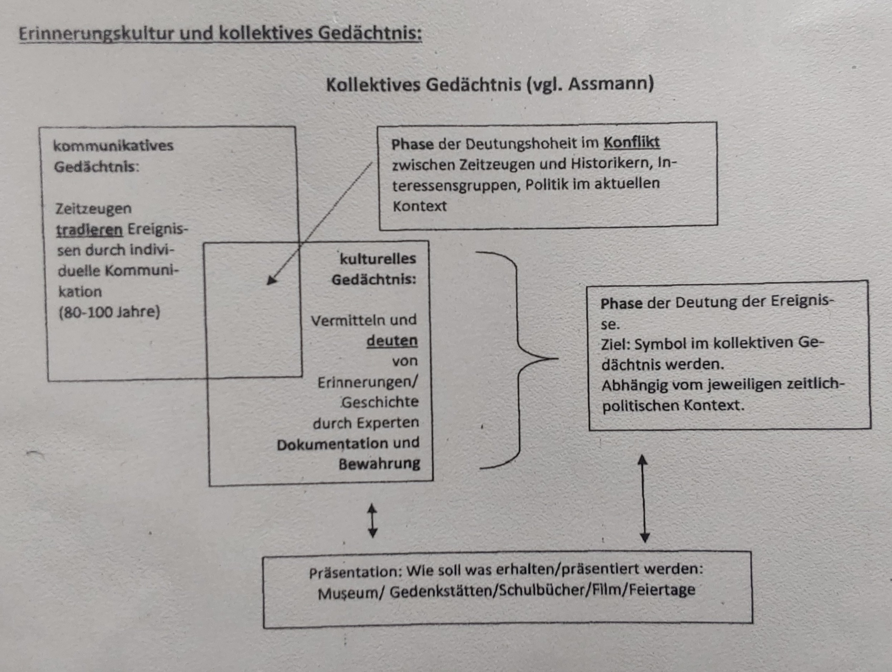

# Erinnerung und Gedächtnis

## "Vom Nutzen und Nachteilen der Historie für das Leben" von Friedrich Nietzsches 1874

- Umgang mit Geschichte beeinflusst Gegenwart und Zukunftserwartungen des Volkes 
- Umgang mit der Geschichte verändert sich
  - Neubewertung
- Vorteile:
  - erinnern zur Identitätsbildung und Selbstverständnis einer Kultur
- Nachteile:
  - "übermächtiges" Erbe: aus der Geschichte können schlechte Beziehungen / Probleme entstehen
    - z. B. NS-Verbrechen: Nachkommen fühlen sich als eingeschrenkt in ihren Handelsmöglichkeiten

## Geschichte als kulturelle Schöpfung

> Jan Assmann: "Vergangenheit steht nicht naturwüchsig an, sie ist eine kulturelle Schöpfung."

Erinnerung an die Vergangenheit und Konstruktion der Geschichte ist individuell und von kulturellen Normen und Werten abhängig.

## Astrid Erll

Es wird mehr vergessen als erinnert wird, aber Vergessenes kann in anderer Zeit wieder als Erinnerungswürdig bewertet werden.

## kollektives Gedächtnis (Jan Assmann)

### kommunikatives Gedächtnis (Generationsgedächtnis)

- bezogen auf die kürzlich geschehene Vergangenheit
- Erinnerungen, die der Mensch mit seinen Zeitgenossen teilt
  - wird durch Träger (Menschen) übertragen
- im Alltag zu gebrauchen
- vergeht mit der Zeit bzw. mit dem Tod der Träger (Menschen) - also der Generation, wenn nicht im Speichergedächtnis oder kulturellen Gedächtnis gespeichert
- Historisch signifikant wird das unmerkliche Absterben eines Gedächtnis-Abschnitts erst, wenn damit bleibende Erfahrungen verbunden sind, die dauerhaft sicher zu stellen sind
  - Nicht historisch signifikantes gerät unmerklich ins vergessene, woran sich die Gesellschaft nicht stört
  - historisch signifikant ist was die Gesellschaft einen Wert beschreibt
  - z. B. NS-Zeit

### kulturelles Gedächtnis

- Erinnerungen gehen von dem kommunikativen Gedächtnis in das kulturelle über Medien, wenn es einen gewissen Erinnerungswert gibt
- spätere Generationen können Zeugen von vergangenem Geschehen werden
- nicht für den Alltag zu gebrauchen
- nicht auf das Individuum, sondern Gesellschaft bezogen
- bestimmt die **kulturelle Identität**
  - Nation und/oder Geselschaft sind durch kollektives Gedächtnis geprägt / gestützt / aufgebaut
- wird über Feste, Rituale, ... übertragen
- Zweck: **Sicherung und Kontinuierung** einer **sozialen Identität**

### Dokumente und Monumente

Gespeicherte Daten sorgen nicht direkt für Erinnerung, sondern müssen - in zweitem Grad - aktiviert werden.

- ersten Grades (**Dokumente**): beruhen auf Kodifikation und Speicherung von Informationen
  - im **Speichergedächtnis** festgehalten
  - hat durch die Sicherung einen Platz - wenn auch nur im Hintergrund - in der Kultur und gehört daher zum **kulturellen Gedächtnis**
- zweiten Grades (**Monumente**): beruhen auf Speicherung plus sozial bestimmten und praktiziertem Erinnerungswert - also sie haben einen Wert, wieso man sich an sie erinnert
  - im **kulturellen Gedächtnis** und **Funktionsgedächtnis**, da es einen Erinnerungswert hat und sich über Kultur erinnert wird oder aus dem Speichergedächtnis ins Funktionsgedächtnis gebracht wird

## Speicher- / Funktionsgedächtnis

- kulturelles Gedächtnis verliert seine Konturen durch die Speicherung von Informationen und verschwimmt mit dem kommunikativen Gedächtnis
- Filme und Bilder fangen das kommunikative Gedächtnis auch für die Nachwelt ein
- Daher neue Gedächtnisformen

### Speichergedächtnis

- objektivierte Daten (auf einem Datenträger gespeichert) - **Dokumente**
- über Schrift kann mehr gespeichert werden, als gebraucht und aktualisiert wird
- enthält eine unstrukturierte Menge von Daten
- der Mensch kann nur schwer über es verfügen

### Funktionsgedächtnis

- wird tatsächlich genutzt
- wird aus dem Speichergedächtnis organisiert, verknüpft und konstruiert, wenn ein gewisser Erinnerungswert gegeben ist - **Monumente**
- an das Subjekt gebunden
  - selektive Informationen werden aus dem Speichergedächtnis mit einer Intention genommen
  - selektives und bewusstes Verfügen über die Vergangenheit
  - die selbe Erinnerung im Speichergedächtnis kann im Funktionsgedächtnis unterschiedliche Bedeutungen haben
- von Kollektiven, Institutionen oder Individuen
  - jeweils unterschiedlicher Funktionsgedächtnisse
  - Geschichte wird sich von einzelnen Subjekten angeeignet
  - Die Gesellschaft bestimmt, wie sich Geschichte angeeignet wird.
- Speicher- und Funktionsgedächtnis nicht immer klar zu trennen
  - Funktionsgedächtnis besteht aus dem Speichergedächtnis
  - identische Speichermedien

### Zusammenspiel der Gedächtnisse

Das kommunikative und kulturelle Gedächtnis existiert parallel zu dem Speicher- und Funktionsgedächtnis. Dabei ist ersteres auf die Erinnerungen, die von Mensch zu Mensch übertragen werden (kommunikatives Gedächtnis) oder Kultur wie Feste, Gedenktage, Mythen, ... übertragen wird (kulturelles Gedächtnis) bezogen. Das Speicher- und Funktionsgedächtnis ist auf gespeicherte Informationen auf Datenträgern bezogen. Dieses spielt mit modernen Speicherformen wie Fotos und Videos eine besonders große Rolle. Das Speichergedächtnis umfasst alles ungeordnet gespeicherte, während das Funktionsgedächtnis alles abgerufene mit praktiziertem Erinnerungswert umfasst. Hier ordnet sich auch der Unterschied von Dokumenten und Monumenten ein. Dokumente (Gespeicherte Daten ersten Grades) befinden sich im Speichergedächtnis und Monumente (Gespeicherte Daten zweiten Grades) sind die abgerufenen und aktivierten Dokumente mit praktiziertem Erinnerungswert im Funktionsgedächtnis und/oder kulturellen Gedächtnis.

## Zuordnung von Beispielen in die Gedächtnisformen

- **Schulbuch**: Funktionsgedächtnis, da strukturiert, nutzbar und tatsächlich benutzt
- **Gedenkfeier zum Reformationstag**: Anlass für Übertragung des kulturellen Gedächtnis
- **Besuch eines vor- und frühgeschichtlichen Museums**: Anlass für Übertragung des kulturellen Gedächtnis
- **Feier am Tag der Deutschen Einheit**: Anlass für Übertragung des kulturellen Gedächtnis
- **Fernsehdokumentation zum Kalten Krieg**: Monument (Funktionsgedächtnis), da es Informationen mit einem praktizierten Erinnerungswert gibt
