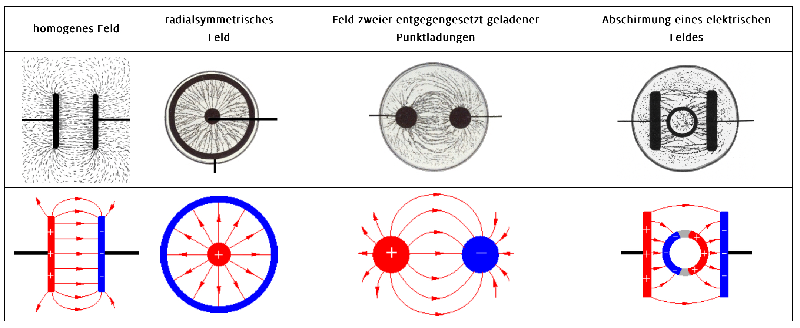
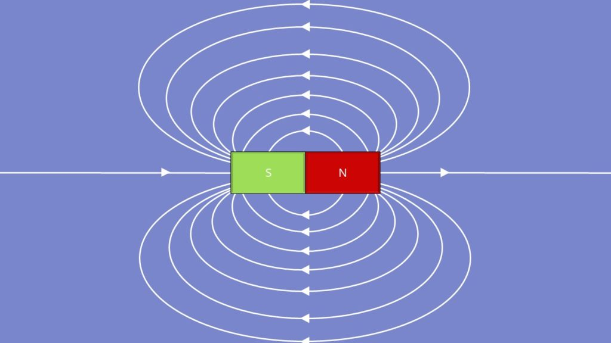

# Felder

## Grundlegende Eigenschaften eines Feldes, Definition des Begriffs „Feld“

> Ein Feld ist die räumliche Verteilung einer physikalischen Größe.

- Wenn in einem Raum elektrische Kraftwirkungen auftreten, so herrscht in diesem Raum ein elektrisches Feld.
- Ein elektrisches Feld wird durch elektrische Ladungen erzeugt. Das Feld ist Vermittler für elektrische Kräfte.

## Feldlinienmodell

Das Feldlinienmodell ist eine Möglichkeit ein Feld zu visualisieren. Die Feldlienen veranschaulichen modellhaft die Struktur des E-Feldes. Je dichter die Feldlinien sind, desto stärker ist das E-Feld.

- Elektrisches Feld: Plus zu Minus
  - Elektrische Feldlinien zeigen immer in die Richtung der Kraft auf einen positiv geladenen Probekörper.
- Magnetisches Feld: Nord zu Süd

TODO Ist Feldlinien zeichen im Tafelwerk?

### grundlegende elektrische Feldlinienbilder

- wirbelfreies Quellenfeld
  - Feldlinien starten bei einer Ladung und haben ein Ziel (andere Ladung / freier Raum)
  - Feldlinien sind keine Kreise / Wirbel (nicht in sich geschlossen)
- Plus -> Minus

#### homogenes Feld

- symmetrische Feldlinien zwischen zwei Platten

### grundlegende magnetische Feldlinienbilder

#### Dipolfeld

- quellenfreies Wirbelfeld
  - die Feldlinien besitzen keine Quelle, sondern sind Kreise bzw. Wirbel d. h. sind geschlossen
  - die Feldlinien gehen durch den Stabmagneten durch
- Nord -> Süd (außen)

#### stromdurchflossener Leiter (Draht)

- ein stromdurchflossener Leiter erzeugt ein Magnetfeld in Kreisbahnen um sich
- kann mit der Linke-Hand-Regel gemessen werden
  - Daumen in Bewegungsrichtung der Elektronen (Richtung Plus)
  - Finger geben die Richtung der Feldlinien des magnetischen Feldes an

## Superposition von Feldern, zeichnerische Addition zweier feldbeschreibender Vektoren in der Ebene

- Felder addieren sich nur (interagieren nicht)
- um das entstehende Feld aus zwei anderen Feldern zu bekommen müssen alle jeweiligen Vektoren des Feldes miteinander addiert werden und das neue Feld entsteht
