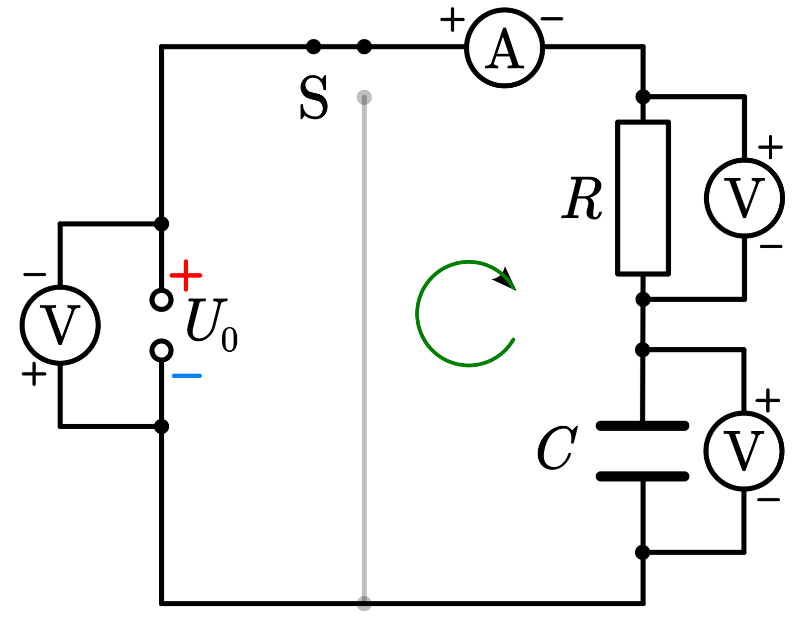

# Plattenkondensator

## Aufbau

- Zwei Platten parallel zueinander
- Dielektrikum (Isolator / nicht Leitend) zwischen den Platten (bestimmt maßgeblich die Kapazität)
- Spannung zwischen den Platten

Es entsteht ein homogenes E-Feld zwischen den Platten.

## Einsatzmöglichkeiten von Kondensatoren in technischen Systemen

Alles, wo für kurze Zeit Strom gespeichert werden muss.

- Smartphones
- Standlicht bei Fahrrad-LED (hohe Kapazität)

## Definition der Kapazität

Die Kapazität ist das Speichervermögen eines Kondensators, also wie viele Ladungen gespeichert werden können.

- Wird in Farad angegeben
- Proportional zu dem Flächeninhalt, der Dielektrizitätszahl und umgekehrt zu dem Abstand der Platten

TODO Experiment zur Bestimmung der Kapazität

## Flächenladungsdichte

> Die Flächenladungsdichte ist die Ladung verteilt über die Fläche eines elektrischen Feldes.

$$\sigma = \frac{Q}{A}$$

## Zusammenhang zwischen Spannung und elektrischer Feldstärke im Plattenkondensator

$$\overrightarrow{E} = \frac{U}{d}$$

Die elektrische Stärke des E-Feldes im Plattenkondensator ist abhängig von der Spannung auf dem Plattenkondensator und der Distanz zwischen den Platten.

## Energie des elektrischen Feldes eines geladenen Kondensators (quantitativ)

- Kondensatoren sind in der Lage elektrische Energie zu speichern.
- Ist ein Kondensator der Kapazität $C$ mit einer Spannung $U$ aufgeladen und trägt die Ladung $Q$, dann gilt für die im Kondensator gespeicherte elektrische Energie $E_{el} = \frac{1}{2} Q U$
  - steht im Tafelwerk
- nur zum Verständnis, kann wenn nötig selber in der Klausur hergeleitet werden (Q und U in die vorherige Gleichung einsetzen): $E_{el} = \frac{1}{2} \cdot \epsilon_0 \cdot \epsilon_r \cdot E^2 \cdot V$

## Dielektrikum

Isolator (nicht Leitend)

1. Die Elektronen der Atome werden durch das Feld zum plus-Pol gezogen.
2. Die Atome werden auf der Seite des Plus-Pols negativ geladen und auf der Seite des Minus-Pols positiv (Dipol) (Polarisierung).
3. Ein Gegenfeld zu dem E-Feld bildet sich.
4. Das E-Feld wird durch das Gegenfeld schwächer.
5. Die Kapazität wird erhöht.

## Abhängigkeit der Kapazität von geometrischen Daten des Plattenkondensators sowie der Dielektrizitätszahl

$C = \epsilon_0 \cdot \epsilon_r \cdot \frac{A}{d}$

- $C \sim \epsilon_r$
- $C \sim A$
- $C \sim \frac{1}{d}$

## zeitlicher Verlauf der Stromstärke beim Aufladevorgang

Der Strom im Kreis kann beim Ausschalten mit einer Exponentialfunktionen beschrieben werden.

- Die Ladung ist das Integral der Stromstärke.

### Widerstand und Kapazität

Die Halbwertszeit ist proportional zum Wiederstand und der Kapazität. Daher dauert der Aufladevorgang mit höherem Wiederstand oder Kapazität länger.

$$t_H = R \cdot C \cdot ln(2)$$

### Schaltplan und Messung der Aufladungskurve

## zeitlicher Verlauf der Stromstärke beim Entladungsvorgang

exponentielle Senkung der Stromstärke

$$t_H = R \cdot C \cdot ln(2)$$

### Schaltplan und Messung der Entladungskurve

> Spannungs-Messgeräte Parallel; Stromstärke-Messgeräte in Reihe

- Spannungsquelle angeschlossen zum Aufladen
- Spannungsquelle wird getrennt
- Ein Widerstand ist angeschlossen, damit es einen Verbraucher gibt, der den Stromkreis schließt
- Über das Messgerät kann die Entladungskurve gemessen werden
