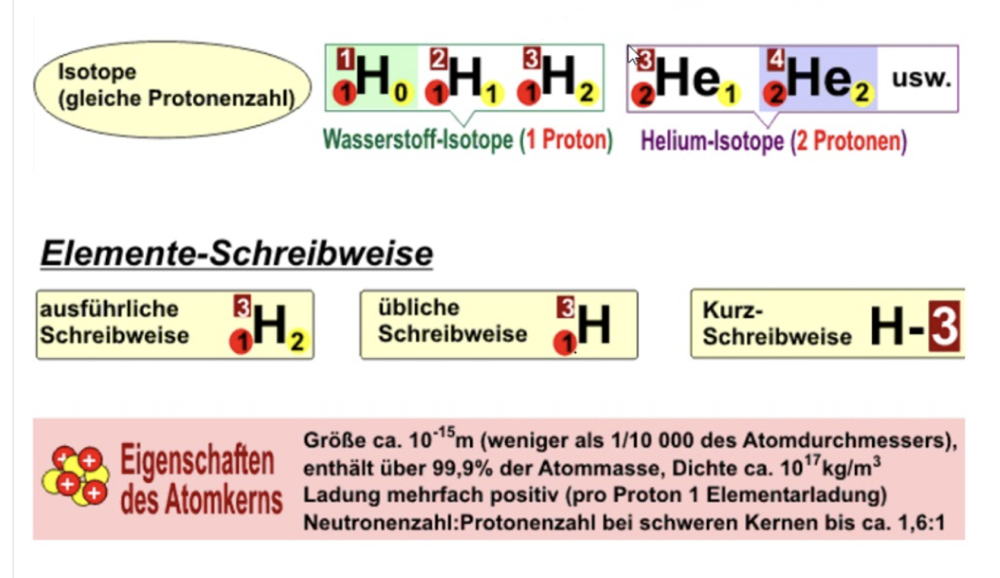

# Der Atomkern

## Rutherford / Bohr

- Alle Atome bestehen aus Neutronen, Protonen (Kern) und Elektronen (Atomhülle).
- Die Masse befindet sich im Kern.
- Neutron leicht schwerer als Proton.

## Elemente und Isotope

- Neutronen und Protonen sind Nukleonen.
- Jedes chemisches Element hat eine feste Protonenzahl Z, kann aber mehrere Isotope mit unterschiedlicher Anzahl an Neutronen besitzen.
- Die Nukleonenzahl ist die Summe der Protonen und Neutronen.

## Kräfte im Kern

### COULOMB-Kraft

- Gleiche Ladungen stoßen sich ab.
- Protonen stoßen sich gegenseitig ab.
- Der Atomkern sollte auseinanderfliegen.

### starke Wechselwirkung

Grund dafür, dass der Atomkern nicht auseinanderfällt.

- Ladungsunabhängig
- Kurze Distanz
- stoßt ab (geringe Distanz) und zieht an (höhere Distanz)
- bei zunehmender Protonenzahl müssen mehr Neutronen sich im Kern befinden, um die kurze Distanz der starken Wechselwirkung auszugleichen, so dass die COULOMB-Kraft ausgeglichen wird

## Potentialtopf im Kern

- Die Nukleonen im Kern sind Quantenobjekte.
- Die Protonen und Neutronen haben ihren jeweiligen Potentialtopf mit unterschiedlichen diskreten Energieniveaus wie bei der Atomhülle
- Die Energie im Kern ist um das millionenfache größer als in der Hülle

